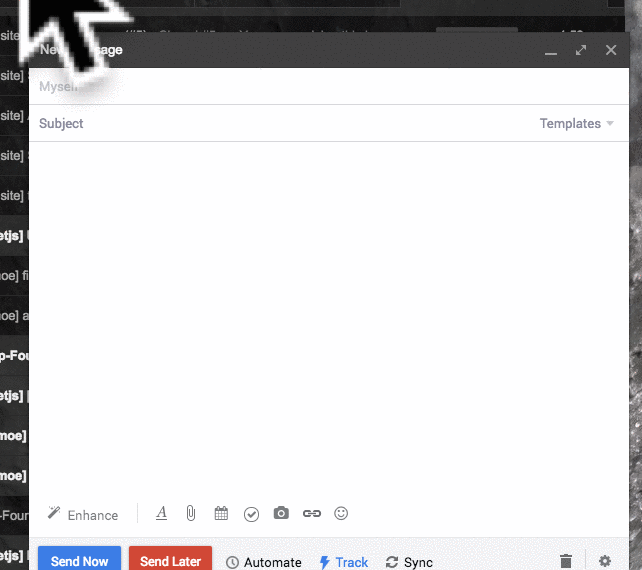

##  Outdoor Activities For Email

This is a fun little open source <a href='https://mixmax.com'>Mixmax</a> Slash Command that uses <a href='https://market.mashape.com/trailapi/trailapi'>Trail API</a> and <a href='https://developers.google.com/maps/documentation/static-maps/'>Google Static Maps API</a>

See <a href='http://developer.mixmax.com/docs/overview-slash-commands#tutorial-building-mygiphy'>Mixmax API documentation</a> for more information.


## Running locally

1. Install using `npm install`
2. Create a .env file with the following:

  ```
    MASHAPE_KEY={your-trail-api-mashape-key}
    GOOGLE_MAPS_KEY={your-trail-api-google-key}
  ```

3. Run using `npm start`


To simulate locally how Mixmax calls the typeahead URL (to return a JSON list of typeahead results), run:

```
curl http://localhost:9145/typeahead?text=cats
```

To simulate locally how Mixmax calls the resolver URL (to return HTML that goes into the email), run:

```
curl http://localhost:9145/resolver?text=cats
```
